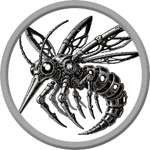

# Stingbat Bot
## A Discord bot for playing Shadowdark RPG

This is a Discord bot designed for playing [Shadowdark RPG](https://www.thearcanelibrary.com/pages/shadowdark "Shadowdark RPG"), by The Arcane Library. It is heavily inspired by [Avrae](https://avrae.io/), a bot designed for playing D&D 5e. I had previously made an attempt to use Avrae for Shadowdark, but found that the differences in spellcasting made it very difficult. Also, I wanted to import characters directly from [Shadowdarklings](https://shadowdarklings.net). Avrae supports importing from a Google Sheet, but Shadowdark characters don't exactly fit in a 5e character sheet.

  <a href="https://discord.com/oauth2/authorize?client_id=1300123142785601667" style="display: inline-block; padding: 10px 20px; background-color: #267CB9; color: white; text-decoration: none; border-radius: 5px; font-weight: bold; margin: 10px 0; border: none;">Invite Stingbat Bot to your server</a>

  <a href="https://discord.com/oauth2/authorize?client_id=1345528655350206494" style="display: inline-block; padding: 10px 20px; background-color: #741D1B; color: white; text-decoration: none; border-radius: 5px; font-weight: bold; margin: 10px 0; border: none;">Invite Development Stingbat Bot to your server</a>

## Getting Started

<iframe src="https://www.loom.com/embed/fd5a49ef14b44687841cb21cdf1fc4eb?sid=2c1db88d-160d-4520-9d46-c3a954aa5032" frameborder="0" webkitallowfullscreen mozallowfullscreen allowfullscreen style="position: absolute; top: 0; left: 0; width: 75%; height: 75%;"></iframe>

## Commands

Here's a sample list of commands implemented so far:

- `!help` - Display a list of commands
- `!character <name>` - Select a character
- `!character list` - List all saved characters
- `!character delete` - Delete a specific character from the database.
- `!sheet` - Display a character sheet summary
- `!details` - Display a character's details: attacks with descriptions, full inventory, and spells
- `!attack <weapon>` - Roll a computed attack roll based on selected character and an equipped weapon
- `!check <stat>` - Make a skill check with the selected character
- `!license` - Display information about the license

Here's a demo of the character selection, attack rolls, and skill check rolls:

<iframe src="https://www.loom.com/embed/bc3a56ebeb144af68aedbdaf8e66f2da?sid=12d03442-0ffe-4899-a091-9375fabcf3d8" frameborder="0" webkitallowfullscreen mozallowfullscreen allowfullscreen style="position: absolute; top: 0; left: 0; width: 75%; height: 75%;"></iframe>

## TODO
- Support importing and updating via Shadowdarklings JSON API when released
- Provide lookup for all the material available under the Shadowdark Third-Party license: spells, monsters, and magic items
- Dice rolling using Avrae's d20 library
- Provide a command-based interface for easy interaction

## Current status
- Imports characters with JSON upload
- Stores characters in Postgres database
- Shows a clean summary of character
- Shows a detailed list of everything parsed with explainations on bonuses
- Ancestries:
  - Elf: Farsight applied to spell casting and ranged attacks
  - Kobold: Knack bonus to spell casting
  - Half-Orc: Mighty bonus to attack and damage
- Classes:
  - Fighter weapon mastery bonus to attack and damage
  - Fighter talent for bonus to attack
  - Wizard talent for plus 1 to spell casting
  - Priest talent for plus 1 to spell casting
- Magic Weapons
  - Apply bonus to attack and damage
  - Tie back to base weapon for weapon mastery
  - Tie back to base weapon for range, damage die

## License
StringbatBot is proprietary software.
Copyright © 2024 Doug Alcorn <dougalcorn@gmail.com>. All rights reserved.
Unauthorized copying, modification, or distribution is prohibited.

StringbatBot is an independent product published under the [Shadowdark RPG Third-Party License](https://www.thearcanelibrary.com/blogs/shadowdark-blog/faq-on-the-shadowdark-rpg-third-party-license) and is not affiliated with The Arcane Library, LLC. Shadowdark RPG © 2023 The Arcane Library, LLC.
